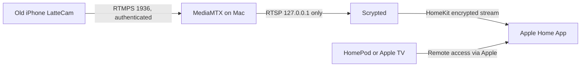

# LatteCam

LatteCam turns an old iPhone into a secure local HomeKit camera by streaming authenticated RTMPS to a Mac running MediaMTX and Scrypted.

This repository is intended to be a secure, reproducible GitHub template. It does not include real certificates, passwords, HomeKit pairing state, Scrypted databases, or machine-specific defaults.


Suggested GitHub topics: `homekit`, `scrypted`, `mediamtx`, `rtmps`, `swiftui`, `ios`, `iphone-camera`, `homekit-camera`, `local-first`, `security`, `smarthome`, `cursor-skills`.

## Architecture



## Security Defaults

- iPhone publishes over authenticated RTMPS.
- Publish password is stored in iOS Keychain.
- MediaMTX RTSP is localhost-only for Scrypted.
- Unused MediaMTX protocols are disabled in the template.
- Generated certs and credentials live under `local-generated/`, which is ignored by git.
- Scrypted database and HomeKit pairing files must never be committed.

Do not forward MediaMTX or Scrypted ports to the internet. For cellular viewing, use Apple HomeKit remote access with a Home Hub.

## Quick Start

Start with `QUICKSTART.md`.

Requirements:

- Xcode 26.5 or newer for HaishinKit 2.2.x.
- iOS 15 or newer on the old iPhone.
- A trusted home LAN with a Mac running MediaMTX and Scrypted.

Core commands:

```sh
scripts/generate-local-ca.sh --host YOUR_MAC_HOST.local --ip YOUR_MAC_IP
scripts/render-mediamtx-config.sh --ip YOUR_MAC_IP --cert local-generated/certs/mediamtx-rtmps.cert.pem --key local-generated/certs/mediamtx-rtmps.key.pem
xcodegen generate
scripts/verify-local-stack.sh YOUR_MAC_IP
```

## Documentation

- `QUICKSTART.md`: end-to-end setup.
- `docs/security.md`: security model and hardening rules.
- `docs/repository-metadata.md`: suggested GitHub description, topics, and settings.
- `docs/runbook.example.md`: safe local runbook template.
- `docs/homekit-scrypted.md`: Scrypted and HomeKit setup.
- `docs/troubleshooting.md`: common failure modes.
- `docs/release-checklist.md`: pre-release checks.
- `templates/mediamtx.yml.template`: hardened MediaMTX config template.

## Agent Skills

Project-level Cursor Agent Skills are included under `.cursor/skills/`:

- `lattecam-bootstrap`
- `lattecam-security-hardening`
- `lattecam-troubleshooting`
- `lattecam-release-sanitizer`

They guide agents through secure setup, hardening, troubleshooting, and release checks.

## Publish Safety

Before pushing or publishing:

```sh
scripts/security-check.sh
```

If the check fails, remove or template the reported values before publishing.

## More
**Just to clarify: LatteCam is more of a proof-of-concept / hackable template than a “everyone should permanently mount an old iPhone as a camera” product.**

The camera app is only one example. The bigger idea is that old iPhones, iPads, or even other hardware can be repurposed as custom HomeKit accessories if you can build the app/bridge around them. With how good AI-assisted coding is getting, the app side is becoming much less of a blocker, so people can customize this for their own needs.

**Also fair point on batteries: I would not recommend leaving an old phone plugged in at 100% forever.** If using it long term, use good ventilation, inspect the battery, avoid swollen batteries, and ideally control charging with a smart outlet / automation.

